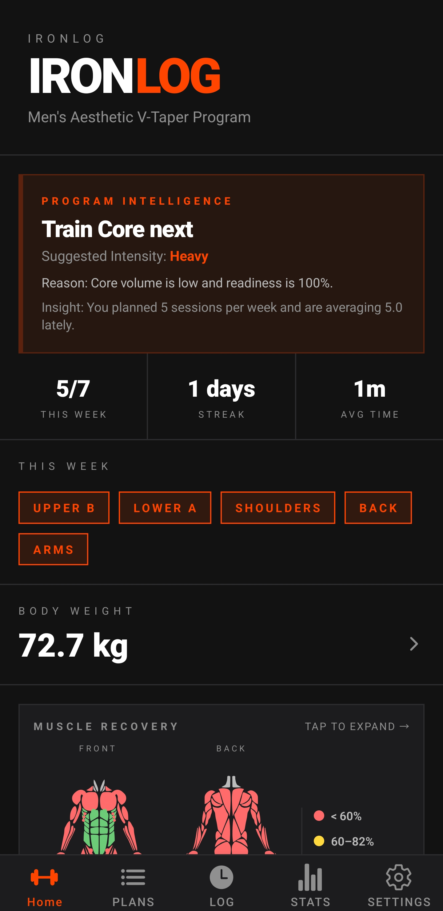
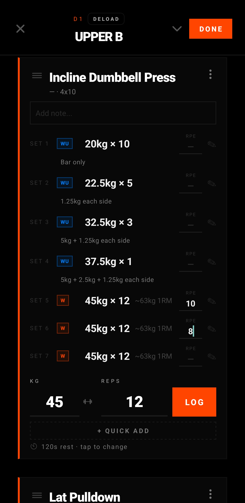
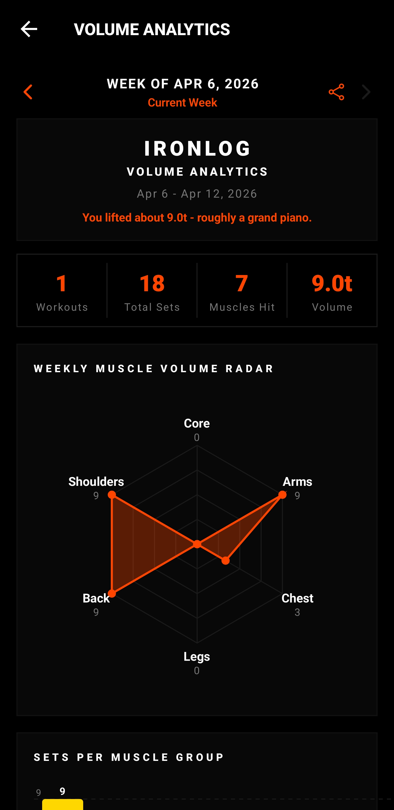
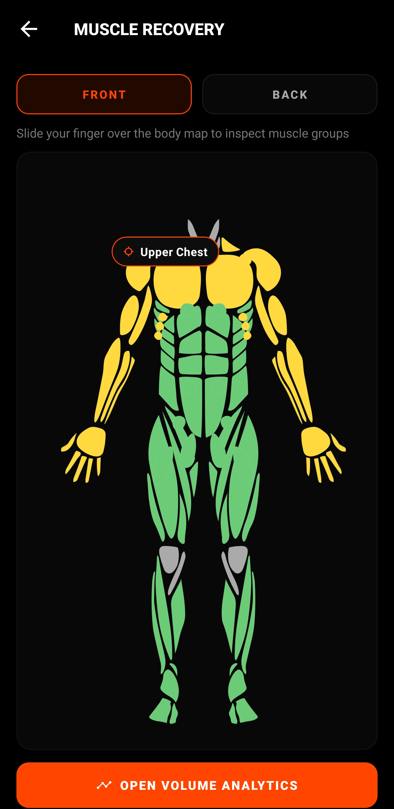

<div align="center">
  

  <h1>IronLog</h1>

  <p><strong>Offline-first workout tracker with recovery heatmaps and useful analytics.</strong></p>

  <p>Built for lifters who want faster logging, real muscle and recovery insight, and local-first control over their training data without cloud lock-in.</p>

  <p>
    <a href="https://github.com/Yannam-Builds/Ironlog/releases"></a>
    <a href="https://github.com/Yannam-Builds/Ironlog/releases"></a>
    <a href="https://github.com/Yannam-Builds/Ironlog/commits"></a>
    <a href="LICENSE"></a>
  </p>

  <p>
    <a href="https://github.com/Yannam-Builds/Ironlog/releases/latest"></a>
    <a href="https://github.com/Yannam-Builds/Ironlog/releases/latest"></a>
  </p>

  <p><sub>Android 7.0+ • offline-first • backup and CSV export built in</sub></p>
</div>

## Featured Screens

<table>
  <tr>
    <td align="center" width="50%">
      
      <br />
      <strong>Smart home overview</strong>
      <br />
      Program intelligence, weekly structure, body weight, and recovery visibility in one screen.
    </td>
    <td align="center" width="50%">
      
      <br />
      <strong>Workout logging</strong>
      <br />
      Fast set-by-set logging with history, notes, rest timers, and smart defaults.
    </td>
  </tr>
  <tr>
    <td align="center" width="50%">
      
      <br />
      <strong>Volume analytics</strong>
      <br />
      Weekly summary cards, radar views, and muscle volume breakdowns from real training data.
    </td>
    <td align="center" width="50%">
      
      <br />
      <strong>Recovery heatmaps</strong>
      <br />
      Interactive front and back muscle maps make recovery and fatigue easy to inspect.
    </td>
  </tr>
</table>

> Built for lifters who want speed, local control, and recovery visibility without subscription bloat.

See the full 30-image feature gallery in [features/README.md](features/README.md).

## Download

Download the latest Android APK from [GitHub Releases](https://github.com/Yannam-Builds/Ironlog/releases/latest).

_Requires Android 7.0 or higher._

## Why IronLog

IronLog is designed to feel fast in the gym and useful after the session. You can log quickly, see recovery and volume clearly, and keep your data on-device instead of depending on a cloud-first backend.

## What You Get

- Fast workout logging with set-by-set entry, set history, smart defaults, notes, resume support, and in-workout actions.
- Rest timer controls with quick add, pause, skip, and workout-in-progress recovery when you leave a session.
- Program intelligence that suggests the next workout, adapts to your training history, and unlocks better recommendations as you log more sessions.
- Built-in programs and plans with browse/import flows, editable workout days, templates, and plan-structure switching.
- Exercise tools with the exercise library, search, custom exercises, swaps, supersets, warm-up generation, and YouTube demo links.
- Recovery heatmaps with interactive front and back muscle maps, touch tooltips, and color-coded readiness.
- Volume analytics with weekly summaries, muscle breakdowns, push/pull/legs balance, radar charts, and shareable cards.
- Progress tracking for body weight, body measurements, progress photos, PRs, history, and calendar views.
- Stats screens with personal bests, session totals, streaks, weekly trends, and workout history.
- Local-first data tools with backup center, restore flows, JSON and CSV import/export, privacy controls, and image caching.
- Gym setup features including gym profiles, bar weight settings, plate calculator, and equipment-aware workflows.
- App customization with AMOLED, dark, light, and Monet themes plus haptics, keep-awake, and effort tracking settings.

## IRONLOG 2.0 - Upcoming Improvements

IRONLOG already covers logging, analytics, and recovery tracking.
Version 2.0 focuses on making those systems smarter, more accurate, and more useful for progression.

### Smarter Training Guidance

- More accurate next-session recommendations based on real performance trends.
- Plateau detection with actionable suggestions, not just static numbers.
- Deload recommendations when performance consistently drops.
- Improved post-workout insights that explain what actually happened.

### Improved Muscle and Recovery Accuracy

- More detailed muscle contribution per exercise beyond basic groups.
- Better weekly volume distribution across muscles.
- More reliable fatigue and recovery estimation.
- Stronger detection of imbalances such as overtraining front delts vs back.

### Better Performance Tracking

- Automatic PR detection for weight, reps, and volume.
- Estimated strength tracking with 1RM trends.
- Clearer exercise-level progress trends over time.
- Workout performance scoring relative to your baseline.

### More Adaptive Programs

- Programs that adjust based on your actual performance.
- Smarter handling of missed workouts.
- Better exercise rotation when lifts stall.

### Smarter Volume Interpretation

- Reworked volume comparisons with a wider and more realistic range.
- Less repetitive analogies with fresher context.
- Context-aware insights tied to your progress.

### Retention and Feedback Improvements

- Workout and logging streaks.
- Milestones and progress highlights.
- Improved weekly summaries.
- Smarter notifications with less spam and more relevance.
- More refined haptic feedback.

### UX Improvements

- Faster logging with better defaults from previous sessions.
- Drag and reorder exercises.
- Collapsible exercise blocks.
- Clearer comparisons to previous performance.

### Goal for 2.0

Make IRONLOG not just track workouts, but interpret them, adapt to them, and help you improve them.

## Suggestions and Community Chat

Have an idea, feature request, or feedback from training with IRONLOG?

- Post it in [Issues](https://github.com/Yannam-Builds/Ironlog/issues/new/choose) so it reaches us directly.
- Want chat-style discussion threads? Enable Discussions in repo settings, then use [GitHub Discussions](https://github.com/Yannam-Builds/Ironlog/discussions).

## Build From Source

```bash
npm install
npx expo run:android
```

If you need to generate native folders locally first:

```bash
npx expo prebuild
```

## Contributing

See [CONTRIBUTING.md](CONTRIBUTING.md) and [CODE_OF_CONDUCT.md](CODE_OF_CONDUCT.md).

## License

IronLog is source-available, not open source in the standard OSI sense.

It is released under the [IronLog Personal Use License](LICENSE) for personal and non-commercial use. Commercial use requires permission.
