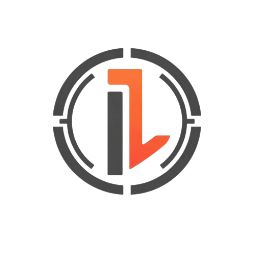
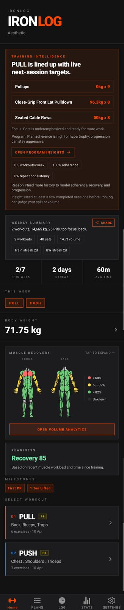
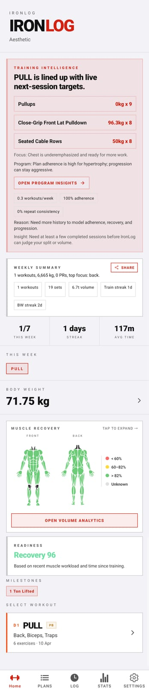
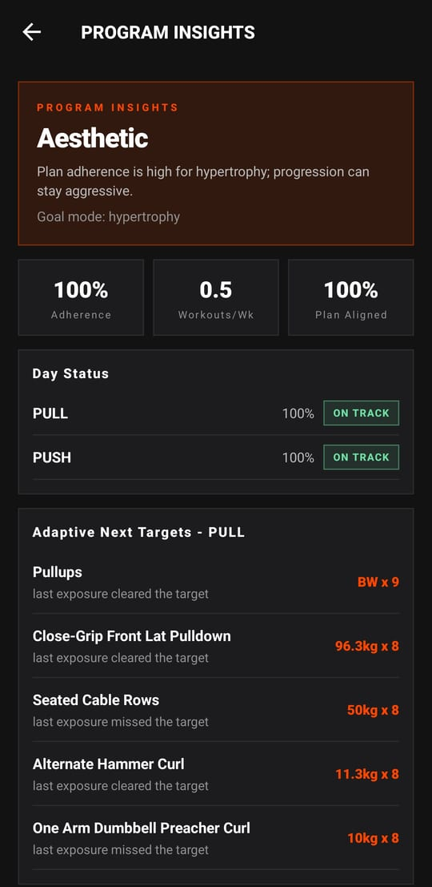
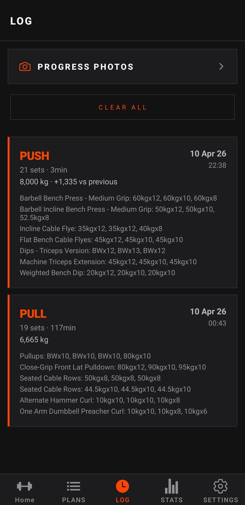
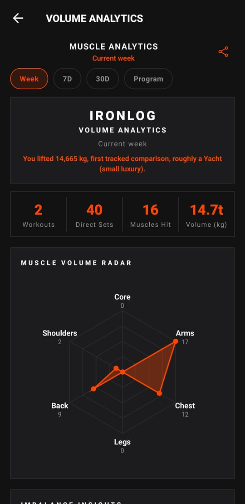
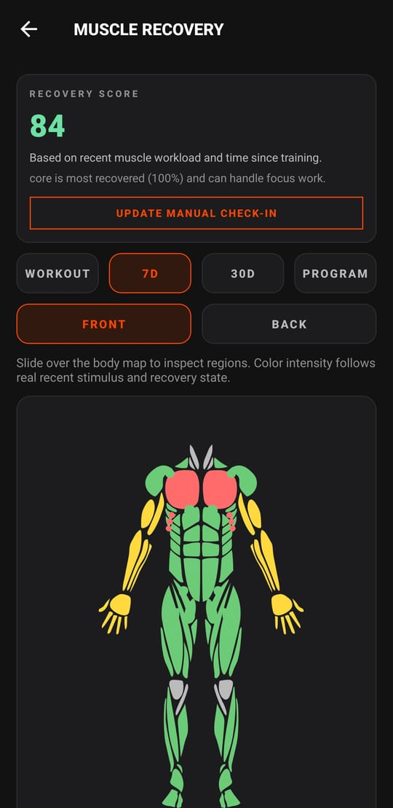
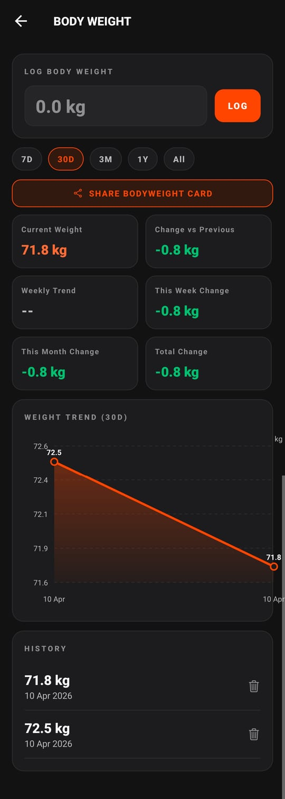
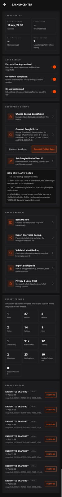

<div align="center">
  

  <h1>IronLog</h1>

  <p><strong>Offline-first Android workout tracker with live next-session targets, muscle analytics, premium themes, and local-first backups.</strong></p>

  <p>Built for lifters who want fast logging in the gym, serious feedback after the session, and full control over their data.</p>

  <p>
    <a href="https://github.com/Yannam-Builds/Ironlog/releases"></a>
    <a href="https://github.com/Yannam-Builds/Ironlog/releases"></a>
    <a href="https://github.com/Yannam-Builds/Ironlog/commits"></a>
    <a href="LICENSE"></a>
  </p>

  <p>
    <a href="https://github.com/Yannam-Builds/Ironlog/releases/latest"></a>
    <a href="https://github.com/Yannam-Builds/Ironlog/releases/latest"></a>
  </p>

  <p><sub>Android 7.0+ | local-first SQLite | encrypted backup and import/export built in</sub></p>
</div>

## Featured Screens

<table>
  <tr>
    <td align="center" width="50%">
      
      <br />
      <strong>AMOLED smart dashboard</strong>
      <br />
      Home combines next-session targets, weekly progress, bodyweight context, and recovery at a glance.
    </td>
    <td align="center" width="50%">
      
      <br />
      <strong>Theme parity</strong>
      <br />
      The visual system carries across AMOLED and light themes instead of treating alternate themes like second-class modes.
    </td>
  </tr>
  <tr>
    <td align="center" width="50%">
      
      <br />
      <strong>Program intelligence</strong>
      <br />
      Goal mode, adherence, day status, and adaptive next targets stay tied to real session history.
    </td>
    <td align="center" width="50%">
      
      <br />
      <strong>Fast logging, readable history</strong>
      <br />
      The app stays fast in-session and still gives you dense session history without turning the log into noise.
    </td>
  </tr>
  <tr>
    <td align="center" width="50%">
      
      <br />
      <strong>Muscle analytics</strong>
      <br />
      Effective sets, volume interpretation, workout totals, and radar views turn raw logs into useful context.
    </td>
    <td align="center" width="50%">
      
      <br />
      <strong>Recovery maps</strong>
      <br />
      Front and back heatmaps reflect recent training stimulus instead of decorative anatomy art.
    </td>
  </tr>
  <tr>
    <td align="center" width="50%">
      
      <br />
      <strong>Bodyweight tracking</strong>
      <br />
      Weight history, trend cards, and share flow stay integrated with the rest of the training system.
    </td>
    <td align="center" width="50%">
      
      <br />
      <strong>Backup and ownership</strong>
      <br />
      Encrypted local snapshots, import/export flows, and Drive backup targets are built into the product, not bolted on later.
    </td>
  </tr>
</table>

See the full 23-shot gallery in [features/README.md](features/README.md) or browse the raw screenshot folder in [features/screenshots/](features/screenshots/).

## Current Android Feature Set

- Fast workout logging with set history, edit/delete, add exercise during session, rest timer, warm-up generation, and premium haptics.
- Plans, built-in program picker, goal modes, Program Insights, adaptive targets, and practical progression rules.
- Muscle analytics, volume radar, imbalance insights, recovery score, front/back recovery maps, and session quality summaries.
- Bodyweight tracking, progress photos, calendar history, stats, PR surfacing, weekly summaries, and share cards.
- AMOLED, light, and Monet-inspired theme variants with the same dense information layout across modes.
- Local-first SQLite storage, encrypted backup center, Drive backup targets, SQLite import/export, and notification policy controls.

## Themes

IronLog is not locked to one visual style. The current Android build ships with an AMOLED-first look, a full light theme, and Monet-inspired variants while keeping the same layout, contrast hierarchy, and training density across all of them.

## What Comes Next

- Phase 1: portability and migration with OpenWeight export/import, Strong and Hevy import review, duplicate detection, and alias resolution.
- Phase 2: coach-grade program building with mesocycle tools, progression models, `%1RM` prescriptions, and optional `RPE` / `RIR` support.
- Phase 3: explainability upgrades so progression, plateau, recovery, and imbalance outputs state why they fired and how confident they are.
- Phase 4: continuity and hardening for larger histories, export parity closure, deeper QA, and optional encrypted multi-device continuity where it genuinely helps.

## Data Ownership

- Internal source of truth: local SQLite on Android.
- Backup today: encrypted local snapshots, SQLite export/import, JSON/CSV flows, and optional Google Drive backup targets.
- Drive supports hidden `AppData` mode and visible folder mode. It is a backup target, not a fake always-on sync layer.

## Download

Download the latest Android APK from [GitHub Releases](https://github.com/Yannam-Builds/Ironlog/releases/latest).

## Build From Source

```bash
npm install
npx expo run:android
```

If native folders need to be generated locally first:

```bash
npx expo prebuild
```

### Signed Release APK (Android)

For update-safe production installs, build with your own release keystore (do not use debug signing):

```bash
cd android
./gradlew assembleRelease
```

Output:

- `android/app/build/outputs/apk/release/app-release.apk`

Install/update on device:

```bash
adb install -r android/app/build/outputs/apk/release/app-release.apk
```

## Suggestions and Community Chat

- Feature requests and bug reports: [Issues](https://github.com/Yannam-Builds/Ironlog/issues/new/choose)
- Optional discussion threads: [GitHub Discussions](https://github.com/Yannam-Builds/Ironlog/discussions)

## Contributing

See [CONTRIBUTING.md](CONTRIBUTING.md) and [CODE_OF_CONDUCT.md](CODE_OF_CONDUCT.md).

## License

IronLog is source-available, not OSI open source.

It is released under the [IronLog Personal Use License](LICENSE) for personal and non-commercial use. Commercial use requires permission.
