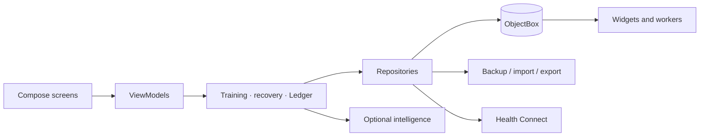

<div align="center">


[](https://github.com/Yannam-Builds/Ironlog/actions/workflows/android.yml)
[](https://github.com/Yannam-Builds/Ironlog/actions/workflows/web-pages.yml)


[](LICENSE)

**A strength-training companion that keeps the workout, recovery context, and earned progress in one local record.**

[Open the web app](https://yannam-builds.github.io/Ironlog/app/) · [Download Android preview](https://github.com/Yannam-Builds/Ironlog/releases/tag/v0.1.0-pre-alpha.8) · [See the native screens](#inside-the-android-app) · [Build locally](#build-and-verify)

</div>

> [!NOTE]
> IronLog is in active pre-alpha development. The signed [`0.1.0-pre-alpha.8` Android preview APK](https://github.com/Yannam-Builds/Ironlog/releases/tag/v0.1.0-pre-alpha.8) is available; there is no Play Store listing yet.

## The training loop


Log load, reps and effort during a session. Use the session and a recovery check-in to understand the next decision. Credit completed work to the Iron Ledger, then adjust the plan. The motion in these diagrams follows that flow and stops when reduced motion is requested.

## Use IronLog

| Android app | Web app |
| --- | --- |
| Jetpack Compose app with ObjectBox storage, Health Connect, foreground workout tracking, widgets, and optional on-device or user-configured cloud intelligence. | Installable browser app with local workout storage, a full-screen mobile layout, and a live app preview inside the website. |
| Plans, workout logging, history, recovery, body tracking, Ledger, and explicit backup/restore. | Home, Plans, Log, Stats, Settings, recovery, measurements, photo comparison, Ledger, and validated backup/restore. |

The web app shares IronLog's visual system and core training flow. It is still a preview: Android-only integrations and some native behavior do not have browser equivalents. The [web acceptance record](web/docs/acceptance.md) and [parity notes](web/docs/domain-parity.md) describe what is tested and what remains different.

Both versions keep their primary record on the device or browser where it was created. There is no automatic account sync. Export and restore are explicit actions; keep a backup before clearing browser data or changing devices.

## Inside the Android app

<table>
  <tr>
    <td width="50%"></td>
    <td width="50%"></td>
  </tr>
  <tr>
    <td align="center"><strong>Home · the next useful action</strong></td>
    <td align="center"><strong>Recovery · context by muscle</strong></td>
  </tr>
</table>

The Home image is a native sample capture using the name **Athlete**. It is not a mockup or a screenshot of a personal training account.

### Built for the work between sets

- **Log quickly.** Record sets, load, reps, effort, rest and notes; resume an active workout after leaving the screen.
- **Follow a plan.** Use a starter program or edit days and exercises. Progression suggestions and substitutions remain explainable and optional.
- **Read recovery with context.** Workout history, manual check-ins, sleep and supported Health Connect inputs can inform training decisions. Readiness is an estimate, not medical clearance.
- **Keep honest progress.** Personal records, streaks, XP, badges and Forge Fox widgets depend on completed training evidence.
- **Own the record.** Workout data lives locally in ObjectBox on Android. IronLog backup, import and export are explicit; automatic Android backup is disabled for sensitive fitness and photo data.

## How it is built


```mermaid
flowchart LR
    UI["Compose screens"] --> STATE["ViewModels"]
    STATE --> DOMAIN["Training · recovery · Ledger"]
    DOMAIN --> DATA["Repositories"]
    DATA --> DB[("ObjectBox")]
    DATA --> PORT["Backup / import / export"]
    DATA --> HC["Health Connect"]
    DOMAIN --> AI["Optional intelligence"]
    DB --> WIDGETS["Widgets and workers"]
```

The Android app uses Kotlin, Jetpack Compose, ObjectBox, WorkManager, Health Connect, CameraX/ML Kit and Jetpack Glance. The separate [web project](web/README.md) uses React, TypeScript and IndexedDB.

## Build and verify

The source is visible for evaluation, but is proprietary. Building, modifying, deploying or redistributing it requires prior written permission under the [IronLog Proprietary License](LICENSE).

Android requires JDK 17 and Android SDK 36. From the repository root:

```sh
./gradlew testDebugUnitTest lintDebug assembleDebug
```

Use `gradlew.bat` on Windows. Release signing stays local; do not commit `local.properties` or a keystore. See [Contributing](CONTRIBUTING.md) and [Security](SECURITY.md).

The web project requires Node 24:

```sh
cd web
npm ci
npm test
npm run build
npm run verify:output
```

GitHub Actions also runs browser acceptance in Chromium and WebKit, including a cached workout with the HTTP origin stopped. See the [Android workflow](https://github.com/Yannam-Builds/Ironlog/actions/workflows/android.yml) and [web workflow](https://github.com/Yannam-Builds/Ironlog/actions/workflows/web-pages.yml) for the current result. Automated coverage does not replace physical-device and accessibility review.

## Project status

Before a store release, IronLog still needs broader Android API/OEM regression coverage, Play data-safety and Health Connect declarations, final privacy and foreground-service review, signing-key/history remediation, and a release version decision. The [native app audit](docs/reviews/2026-08-31-ironlog-app-audit.md) and [notification/settings audit](docs/reviews/2026-09-01-notification-feature-harmony-settings-audit.md) record known issues and their evidence.

Original IronLog code, branding and artwork are proprietary. Earlier versions remain under the terms shipped with those versions; public visibility does not make this repository open source. Third-party software, font and data notices are in [Third-party notices](THIRD_PARTY_NOTICES.md).

<div align="center"><strong>Train. Recover. Prove it.</strong></div>
