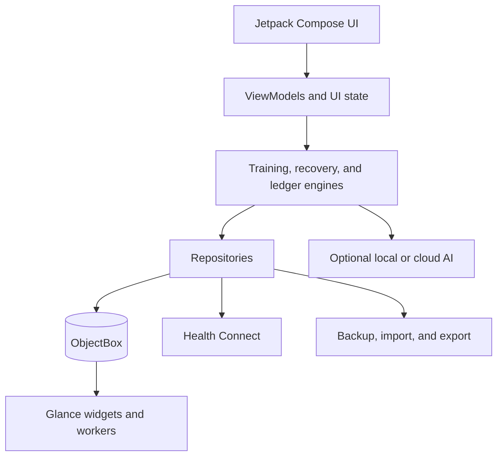

<div align="center">


[](https://github.com/Yannam-Builds/Ironlog/actions/workflows/android.yml)


[](LICENSE)

**A native Android strength-training companion for fast logging, recovery awareness, plans, and an honest record of the work.**

[Website & web app](#ironlog-web-preview) · [Features](#built-for-the-work-between-sets) · [Screens](#the-current-build) · [Architecture](#how-it-is-built) · [Authorized build](#build-for-authorized-evaluation) · [License](#license-and-ownership)

</div>

> [!NOTE]
> IronLog is under active development and remains a pre-alpha product. The current source identifies as `0.1.0-pre-alpha.8` (`versionCode 9`). The older [public Android pre-alpha](https://github.com/Yannam-Builds/Ironlog/releases/tag/v0.1.0-pre-alpha.1) remains available for testing; it is not the current source build.

## IronLog Web preview

The website now has a separate product landing page and a local-first browser app under [`web/`](web/README.md). The production addresses are [the website](https://yannam-builds.github.io/Ironlog/) and [the web app](https://yannam-builds.github.io/Ironlog/app/); GitHub Pages deploys the new output only after the website workflow passes.

The September 2026 repository update includes:

- The current transparent monochrome IronLog mark, lighter Lexend landing typography, Forge Fox artwork and twelve native themes shared between the page and app. Native app headings keep their heavier weight.
- **Make it yours:** Lexend plus 20 locally bundled font families, Original/Light/Regular/Bold styles, and a Settings → Layout spacing slider (85–125%). Font selection is shared by the landing page, phone preview and full-screen web app. Spacing adjusts padding and gaps without zooming text or artwork. Choose **Lexend + Light** for the landing-page feel; defaults remain unchanged until you choose.
- A real interactive app inside a phone frame on the landing page—not a desktop dashboard or an Android emulator. Onboarding and workouts save in this browser. Open the same app full-screen for Android Chrome or iPhone Safari; no separate account is needed.
- Home, Plans, Log, Stats and Settings; saved onboarding, editable plans, custom exercises, notes, explicit warmup queues, resumable workouts, set editing/deletion, rest timers and plate calculation.
- Local history, recovery estimates, Ledger progression, body measurements, photo comparison and validated backup/restore. No account, phone synchronization or browser cloud-AI backend.
- Opaque modal sheets with keyboard focus wrapping, Escape dismissal and blocked background taps; mobile safe-area layouts and accessible numeric entry.
- A six-paper research bibliography with limitations, separate software/font notices, and optional Home Screen installation.

**Preview, not full native parity.** The web acceptance suite covers unit, browser, production-output, responsive, appearance, persistence and offline-startup paths. These automated results do not replace physical iPhone Home Screen, VoiceOver or broad Android-device verification. See the [acceptance record](web/docs/acceptance.md), [native parity gaps](web/docs/domain-parity.md) and [offline investigation](web/diagnostics/OFFLINE-WEBKIT.md).

**Live deployment verified, 31 August 2026:** [workflow run for `974ed50`](https://github.com/Yannam-Builds/Ironlog/actions/runs/33373046339) passed 85 unit tests, 29 browser tests, both supplemental offline tests, build/output checks and deployment. Pages now uses **GitHub Actions** and serves only the built `web/dist`, not the legacy README renderer. All nine phone-preview tests also passed against the public website, including embedded workout completion in Chromium, WebKit and Android Chrome emulation. The app-independent WebKit offline-emulation failure remains a diagnostic; the application gate closes its actual HTTP origin and verifies cached startup and workout persistence without it.

Workout instruction media from OpenGym is **not bundled**: its media notice and upstream dataset require separate reuse permission. Kotlin source, APKs and phone data are unchanged by this website update.

The [deeper OpenGym feature review](web/docs/opengym-feature-reference-2026-08-31.md) proposes six independently implementable Kotlin improvements: source-linked records, consistent exercise discovery, explicit note lifetimes, date-specific scheduling, atomic day copying and clearly scoped backups. It includes source-level issues to investigate, not claims that those native changes have shipped.

Run locally with Node 24:

```sh
cd web
npm ci
npm run dev
```

The landing page runs at `http://127.0.0.1:5173/Ironlog/`. See the [web README](web/README.md) for production-preview and test commands.

## Built for the work between sets

IronLog keeps the main training loop fast and keeps the primary record on your device.

- **Log without friction.** Active sessions support sets, load, reps, timers, exercise substitutions, progression suggestions, and resumable foreground tracking.
- **See recovery, not just history.** Muscle readiness, sleep and biometric inputs, manual check-ins, and Health Connect can inform what to train next.
- **Work from a plan.** Build programs, choose starter plans, preserve exercise notes and supersets, create custom exercises, swap for one session or the plan, and exchange plans through validated JSON import/export.
- **Keep an honest ledger.** Streaks, XP, personal records, milestones, and Forge Fox widgets are derived from completed work.
- **Own the data.** ObjectBox stores the core record locally. Explicit IronLog backup, restore, import, and export remain available; automatic Android backup is disabled for sensitive fitness and photo data.
- **Choose the intelligence.** On-device and user-configured cloud AI paths are optional. The workout logger does not require an AI provider.


## The current build

<table>
  <tr>
    <td width="50%"></td>
    <td width="50%"></td>
  </tr>
  <tr>
    <td align="center"><strong>Training command center</strong></td>
    <td align="center"><strong>Muscle recovery map</strong></td>
  </tr>
</table>

The September 2026 stabilization pass adds stable set identities and serialized workout mutations; pending warmups that never auto-log; durable exercise notes; transactional imports, restores, completion and notification cleanup; unified recovery, progression and Ledger inputs; compact effort controls; opaque overlays; configurable typography, spacing, card shine and liquid-glass navigation; and expanded regression coverage. QR plan sharing has been removed in favor of JSON because complete plans are too large for reliable QR transport.

## How it is built


```mermaid
flowchart TD
    UI["Jetpack Compose UI"] --> VM["ViewModels and UI state"]
    VM --> DOMAIN["Training, recovery, and ledger engines"]
    DOMAIN --> REPOS["Repositories"]
    REPOS --> DB[(ObjectBox)]
    REPOS --> HC["Health Connect"]
    DOMAIN --> AI["Optional local or cloud AI"]
    REPOS --> PORT["Backup, import, and export"]
    DB --> WIDGETS["Glance widgets and workers"]
```

The app is Kotlin-first and uses Jetpack Compose, ObjectBox, WorkManager, Health Connect, CameraX/ML Kit, Jetpack Glance, Vico, Coil, and Ktor. Java 17 is required for the Android build.

## Build for authorized evaluation

The source is publicly visible for product evaluation and project transparency, but it is not open source. Building, modifying, deploying or redistributing it requires prior written permission under the [IronLog Proprietary License](LICENSE).

Requirements: Android Studio with Android SDK 36, JDK 17, and an Android 8.0+ device or emulator.

```bash
git clone https://github.com/Yannam-Builds/Ironlog.git
cd Ironlog
./gradlew testDebugUnitTest lintDebug assembleDebug
```

On Windows, use `gradlew.bat` instead of `./gradlew`.

Release signing is intentionally local. Create `local.properties` with your own version and signing values and provide your own `app/ironlog-release.jks`; never reuse project-owner signing material.

```properties
version.code=1
version.name=1.0.0
signing.storePassword=your-store-password
signing.keyPassword=your-key-password
```

## Verification status

- `:app:lintDebug` passes with no errors.
- The current JVM suite reports **708 tests**, zero failures/errors and one intentional skip.
- The latest API 36.1 emulator instrumentation pass reports **66 tests**, zero failures/errors and one intentional skip.
- Signed, minified APK and AAB builds pass with the private local signing configuration.
- Fresh onboarding, active-workout persistence, notes, warmups, recovery, Ledger, notifications, responsive layouts and release-upgrade behavior have dedicated automated or exploratory coverage.
- A signed release was installed over the existing physical-device build with app data preserved; wider OEM/API coverage is still required before a Play Store production claim.

Physical-device coverage is still being expanded. See [Security](SECURITY.md) for private vulnerability reporting and [Contributing](CONTRIBUTING.md) before proposing a change.

## Project status

Current release blockers are broader API 26–35 and physical-device regression testing, Play data-safety/Health Connect declarations and review of the [public privacy notice](https://yannam-builds.github.io/Ironlog/privacy/), cloud-AI reporting/disable controls where Play policy requires them, signing-key rotation plus historic-secret remediation, foreground-service declaration review, and a production version/release decision. The dated [app audit](docs/reviews/2026-08-31-ironlog-app-audit.md) and [notification/feature harmony audit](docs/reviews/2026-09-01-notification-feature-harmony-settings-audit.md) separate current work from historical implementation notes.

## License and ownership

IronLog's current and future original code, product design, branding and artwork are proprietary. No permission is granted to sell, redistribute, rebrand, host, monetize, or create derivative products without a separate written agreement from the owner. Public visibility does not make this an open-source project.

Versions previously published under other terms remain governed by the terms that accompanied those versions; in particular, rights already granted under an earlier MIT release cannot be revoked retroactively. GitHub also gives users limited platform rights to view and fork public repositories. Keeping the source private while publishing only official builds is the stronger option if public inspection is no longer desired.

Required attributions and licenses for third-party fonts, software and exercise data are preserved in [Third-party notices](THIRD_PARTY_NOTICES.md). Authorized contributors must read the [contribution policy](CONTRIBUTING.md) before submitting code or assets. For commercial licensing or acquisition discussions, contact `ironlogsupport@gmail.com`.

---

<div align="center">
  <strong>Train. Recover. Prove it.</strong><br>
  <sub>Built for the record you earn.</sub>
</div>
