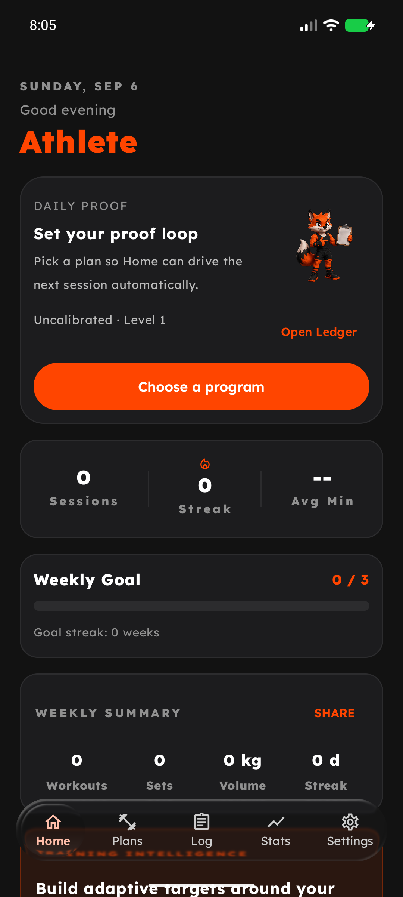
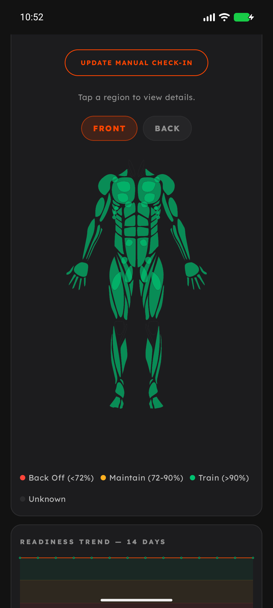
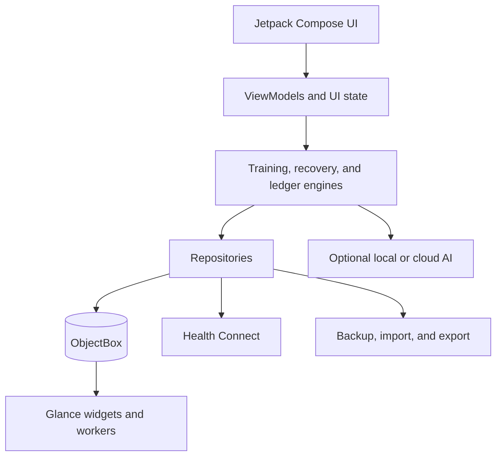

<div align="center">


[](https://github.com/Yannam-Builds/Ironlog/actions/workflows/android.yml)


[](LICENSE)

**A native Android strength-training companion for fast logging, recovery awareness, plans, and an honest record of the work.**

[Features](#built-for-the-work-between-sets) · [Screens](#the-current-build) · [Architecture](#how-it-is-built) · [Build](#build-it-locally) · [Contributing](CONTRIBUTING.md)

</div>

> [!NOTE]
> IronLog is under active development and physical-device QA. The signed build is not distributed from this repository yet; build locally or follow a future tagged release.

## Built for the work between sets

IronLog keeps the main training loop fast and keeps the primary record on your device.

- **Log without friction.** Active sessions support sets, load, reps, timers, exercise substitutions, progression suggestions, and resumable foreground tracking.
- **See recovery, not just history.** Muscle readiness, sleep and biometric inputs, manual check-ins, and Health Connect can inform what to train next.
- **Work from a plan.** Build programs, choose starter plans, save sessions back to plans, or share compatible plans through bounded QR payloads.
- **Keep an honest ledger.** Streaks, XP, personal records, milestones, and Forge Fox widgets are derived from completed work.
- **Own the data.** ObjectBox stores the core record locally. Explicit IronLog backup, restore, import, and export remain available; automatic Android backup is disabled for sensitive fitness and photo data.
- **Choose the intelligence.** On-device and user-configured cloud AI paths are optional. The workout logger does not require an AI provider.


## The current build

<table>
  <tr>
    <td width="50%"></td>
    <td width="50%"></td>
  </tr>
  <tr>
    <td align="center"><strong>Training command center</strong></td>
    <td align="center"><strong>Muscle recovery map</strong></td>
  </tr>
</table>

The July 2026 stabilization pass includes API 36 targeting, transactional workout and import writes, hardened backup/import behavior, corrected readiness and streak clocks, bounded QR decoding, centered recovery-map transforms, and release builds verified on an API 36.1 emulator and a physical Android device.

## How it is built


```mermaid
flowchart TD
    UI["Jetpack Compose UI"] --> VM["ViewModels and UI state"]
    VM --> DOMAIN["Training, recovery, and ledger engines"]
    DOMAIN --> REPOS["Repositories"]
    REPOS --> DB[(ObjectBox)]
    REPOS --> HC["Health Connect"]
    DOMAIN --> AI["Optional local or cloud AI"]
    REPOS --> PORT["Backup, import, and export"]
    DB --> WIDGETS["Glance widgets and workers"]
```

The app is Kotlin-first and uses Jetpack Compose, ObjectBox, WorkManager, Health Connect, CameraX/ML Kit, Jetpack Glance, Vico, Coil, and Ktor. Java 17 is required for the Android build.

## Build it locally

Requirements: Android Studio with Android SDK 36, JDK 17, and an Android 8.0+ device or emulator.

```bash
git clone https://github.com/Yannam-Builds/Ironlog.git
cd Ironlog
./gradlew testDebugUnitTest lintDebug assembleDebug
```

On Windows, use `gradlew.bat` instead of `./gradlew`.

Release signing is intentionally local. Create `local.properties` with your own version and signing values and provide your own `app/ironlog-release.jks`; never reuse project-owner signing material.

```properties
version.code=1
version.name=1.0.0
signing.storePassword=your-store-password
signing.keyPassword=your-key-password
```

## Verification status

- `:app:lintDebug` passes with no errors.
- 134 JVM tests pass.
- Signed, minified APK and AAB builds pass with the private local signing configuration.
- Fresh onboarding, starter-plan selection, Home, Recovery Map front/back views, muscle hit testing, and landscape recreation were smoke-tested on an API 36.1 Pixel 7 emulator.
- The latest stable signed APK was installed on a physical device with app data preserved.

Physical-device coverage is still being expanded. See [Security](SECURITY.md) for private vulnerability reporting and [Contributing](CONTRIBUTING.md) before proposing a change.

## Project status

Current priorities are broader physical-device regression testing, signing-key rotation before public store distribution, and final distribution infrastructure. The dated [codebase review](docs/CODEBASE_REVIEW_2026-07-27.md) separates current work from historical implementation notes under `docs/superpowers/`.

---

<div align="center">
  <strong>Train. Recover. Prove it.</strong><br>
  <sub>Built for the record you earn.</sub>
</div>
